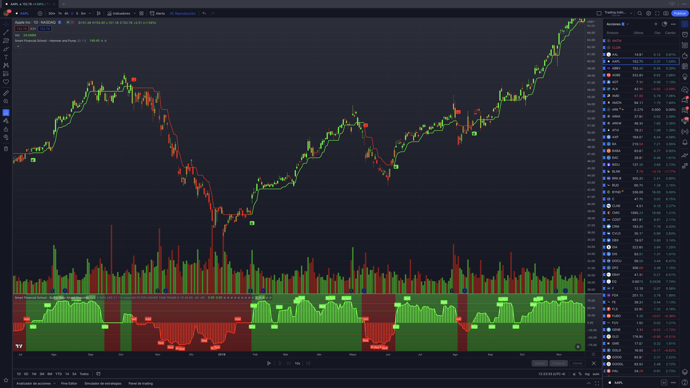

# 🚀 Hammer And Pump A.I | smarttradingindicators.com

Welcome to the next level of trading with Hammer And Pump A.I, a cutting-edge trading tool developed with artificial intelligence and advanced filtering techniques. This indicator provides real-time signals, enabling traders to seize the best opportunities in the financial markets.

## 🌟 Features

- AI-Powered Trend Detection: Utilizes artificial intelligence to deliver precise trend analysis.
- Real-Time Signals: Offers immediate buy and sell signals, color-coded for easy interpretation.
- Versatile and Adaptable: Perfectly suited for various trading methodologies, including swing trading and day trading.
- Universal Compatibility: Works across all markets and timeframes, identifying potential trading opportunities.
- Profitability: Enhances decision-making accuracy, leading to potential increased profitability.

⚙️ Settings

Hammer And Pump A.I offers a variety of customizable settings to match your unique trading style:

- BB Period: Set the period for Bollinger Bands. Can be any integer greater than 0.
- BB Deviations: Adjust the standard deviation multiplier for Bollinger Bands.
- ATR Filter: Enable or disable the Average True Range filter.
- ATR Period: Set the period for the ATR. Can be any integer greater than 0.
- Hide Labels: Enable or disable the display of buy/sell labels.

💡 Usage

Use Hammer And Pump A.I to identify potential buying or selling opportunities based on the trend. The trend generated by this indicator can serve as a potential entry point to open positions and place stop loss and take profit orders.

While Hammer And Pump A.I is a powerful tool, it is recommended to use it in conjunction with other technical analysis tools and a robust trading strategy to manage risk and establish precise market entry and exit points.

❗ Disclaimer

Trading involves risk. Hammer And Pump A.I is a supplementary tool designed to assist your trading decisions. It's essential to combine the indicator's signals with comprehensive market analysis and sound risk management strategies.

📬 Contact

We're eager to hear from you! For questions, feedback, or suggestions, please contact us at support@smarttradingindicators.com.

🔒 Note on Code Access

The code for Hammer And Pump A.I is proprietary and not publicly accessible. For inquiries about the code or if you need further information, don't hesitate to reach out at support@smarttradingindicators.com. We appreciate your understanding.

Thank you for considering Hammer And Pump A.I for your trading needs! We are confident that this tool will bring a new level of clarity and precision to your market analysis.
